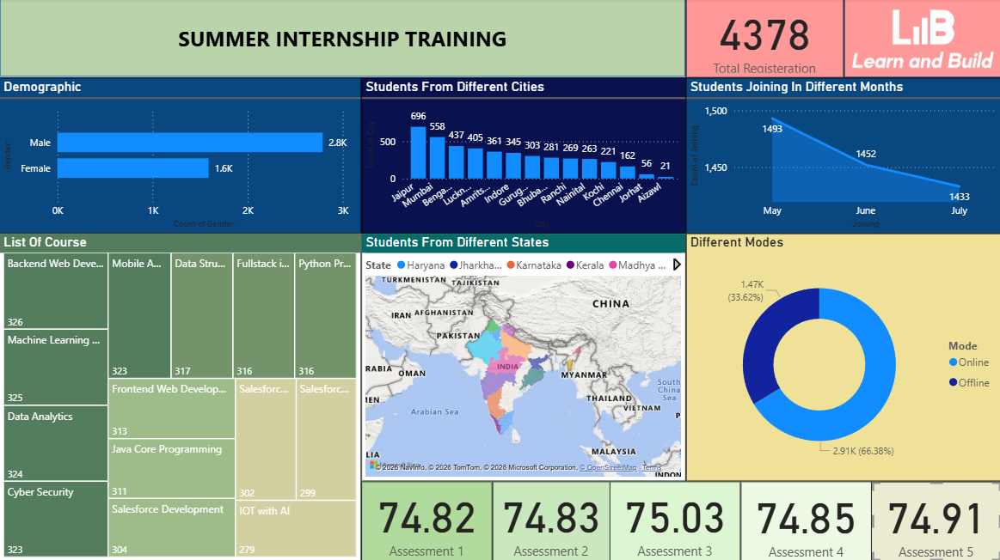
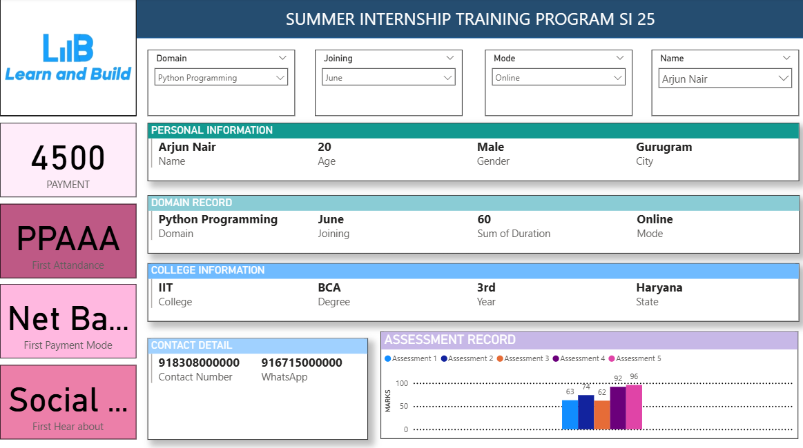
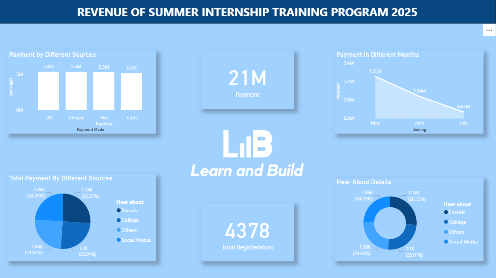

# MaitriYadav-Summer-Internship-PowerBI-Dashboard
Data visualization project in Power BI showcasing student analytics, course distribution, and revenue insights for a summer internship program.

### 🔹 Overview Dashboard
<Provides a high-level summary of the internship program, including total registrations, gender distribution, and geographic spread of students.>

### 🔹 Student Details Dashboard
<Displays detailed information about individual students, including domain selection, college, and performance.
>

### 🔹 Revenue Dashboard
<Shows total revenue, payment methods, and monthly revenue trends.>

